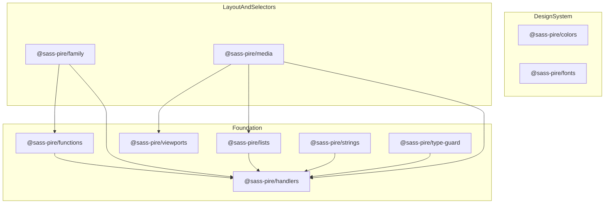

# SASS Pire

*Just more mixins and functions with SCSS for more productive projects.*

`sass-pire` is a modular SCSS library distributed as scoped npm packages under `@sass-pire/*`. Install only the packages you need — colors, typography, media queries, selector helpers, and low-level Sass utilities — and compose them in your project with `@use`.

> **What changed in v6**
>
> Starting with v6, the library is a **Yarn workspaces monorepo**. The root `sass-pire` package is **private** and exists for development only. Published consumers install individual **`@sass-pire/*`** packages instead of a single `sass-pire` bundle.

---

## Table of Contents

- [Monorepo Overview](README.md#monorepo-overview)
- [Packages](README.md#packages)
- [Migrating from sass-pire v5 and Earlier](README.md#migrating-from-sass-pire-v5-and-earlier)
- [General Setup](README.md#general-setup)
- [Package Guides](README.md#package-guides)
  - [@sass-pire/colors](README.md#sass-pirecolors)
  - [@sass-pire/fonts](README.md#sass-pirefonts)
  - [@sass-pire/functions](README.md#sass-pirefunctions)
  - [@sass-pire/handlers](README.md#sass-pirehandlers)
  - [@sass-pire/lists](README.md#sass-pirelists)
  - [@sass-pire/strings](README.md#sass-pirestrings)
  - [@sass-pire/type-guard](README.md#sass-piretype-guard)
  - [@sass-pire/viewports](README.md#sass-pireviewports)
  - [@sass-pire/media](README.md#sass-piremedia)
  - [@sass-pire/family](README.md#sass-pirefamily)
- [Development](README.md#development)
- [Contributing](README.md#contributing)
- [Feature Requests](README.md#feature-requests)
- [License](README.md#license)

---

## Monorepo Overview

| Topic | Details |
|---|---|
| Workspace tool | [Yarn 4.16](https://yarnpkg.com/) — run `yarn install` at the repo root |
| Node version | v20.17.0 (see [.nvmrc](.nvmrc)) |
| Package locations | [`packages/*`](packages/) |
| Package count | 10 `@sass-pire/*` packages at v1.0.0 |
| Root package | `sass-pire` v6.0.0 — **private**, not published to npm |



---

## Packages

| Package | Purpose | Docs |
|---|---|---|
| `@sass-pire/colors` | Color scales and CSS custom properties | [README](packages/colors/README.md) |
| `@sass-pire/fonts` | Fluid typography utilities | [README](packages/fonts/README.md) |
| `@sass-pire/functions` | Unit and math helpers (`cut-unit`, `half`, etc.) | [README](packages/functions/README.md) |
| `@sass-pire/handlers` | Shared error handling (`throw()`, `$dev-env`) | [README](packages/handlers/README.md) |
| `@sass-pire/lists` | List manipulation functions | [README](packages/lists/README.md) |
| `@sass-pire/strings` | String utilities | [README](packages/strings/README.md) |
| `@sass-pire/type-guard` | Unit and type validation helpers | [README](packages/type-guard/README.md) |
| `@sass-pire/viewports` | Breakpoint configuration maps | [README](packages/viewports/README.md) |
| `@sass-pire/media` | `mq` / `cq` mixins (depends on viewports) | [README](packages/media/README.md) |
| `@sass-pire/family` | nth-child selector mixins | [README](packages/family/README.md) |

---

## Migrating from sass-pire v5 and Earlier

If you previously installed the monolithic `sass-pire` package, update your install and imports as follows.

### Install

```bash
# Before (legacy)
npm i -D sass-pire

# After (v6) — install only what you need
yarn add -D @sass-pire/colors @sass-pire/media

# Or with npm
npm install -D @sass-pire/colors @sass-pire/media
```

### Import

```scss
// Before
@use "sass-pire" as *;

// After
@use "@sass-pire/colors" as colors;
@use "@sass-pire/media" as *;
```

### Feature mapping

| Old mental model | New package(s) |
|---|---|
| Color variables / palettes | `@sass-pire/colors` |
| Typography / font sizes | `@sass-pire/fonts` |
| Sass functions (units, math) | `@sass-pire/functions` |
| Breakpoints / media queries | `@sass-pire/viewports` + `@sass-pire/media` |
| nth-child / selector helpers | `@sass-pire/family` |
| Argument validation | `@sass-pire/type-guard`, `@sass-pire/handlers` |
| List utilities | `@sass-pire/lists` |
| String helpers | `@sass-pire/strings` |

### Removed or not yet available

The following features from earlier versions are **not** part of the current `@sass-pire/*` packages:

- **[reset-zone](https://www.npmjs.com/package/reset-zone) integration** — no longer bundled
- **Utility CSS classes** — not included in the current package set
- **Umbrella `@use "sass-pire"`** — there is no published meta-package yet; install individual scoped packages instead

> [CHANGELOG.md](CHANGELOG.md) has not yet been updated for the v6 monorepo split. This section documents the migration until the changelog is brought up to date.

---

## General Setup

### Standalone install

Install any package with your preferred package manager:

```bash
yarn add @sass-pire/colors
npm install @sass-pire/colors
pnpm add @sass-pire/colors
```

### Monorepo consumer

If your project lives inside a Yarn workspace alongside sass-pire:

```json
{
  "dependencies": {
    "@sass-pire/colors": "^1.0.0"
  }
}
```

Then run `yarn install`.

### SCSS imports

Use `@use` with scoped package names:

```scss
@use "@sass-pire/colors" as colors;
@use "@sass-pire/media" as *;
```

### Configure load path

Add the `--load-path=node_modules` flag to your Sass command so scoped packages resolve correctly:

```json
"scripts": {
  "watch:sass": "sass --load-path=node_modules --watch ./src/index.scss"
}
```

### Deprecation notice

The `@import` statement is deprecated in Dart Sass. Use `@use` and `@forward` instead.

---

## Package Guides

Each section below covers install, import, and a focused usage example. For the full API, see the linked package README.

---

### @sass-pire/colors

Color utilities and configuration for the sass-pire design system — neutral, red, blue, orange, green, yellow, violet, cyan, pink, and indigo palettes.

**Install**

```bash
yarn add @sass-pire/colors
```

**Import**

```scss
@use "@sass-pire/colors" as colors;
@use "@sass-pire/colors/src/neutral" as *;
```

**Example**

```scss
@use "@sass-pire/colors/src/neutral" as *;

@include sp-get-neutral(); // Generates CSS custom properties on :root

.card {
  background-color: var(--sp-neutral-100);
  color: var(--sp-neutral-900);
}
```

**Pre-compiled CSS** — import compiled output without Sass:

```scss
@use "@sass-pire/colors/css";
@use "@sass-pire/colors/css/min";
```

Full API → [packages/colors/README.md](packages/colors/README.md)

---

### @sass-pire/fonts

Font utilities and configuration — fluid font sizes, weights, letter-spacing, and line-height.

**Install**

```bash
yarn add @sass-pire/fonts
```

**Import**

```scss
@use "@sass-pire/fonts" as fonts;
@use "@sass-pire/fonts/src/size" as *;
```

**Example**

```scss
@use "@sass-pire/fonts/src/size" as *;

@include sp-get-fs(); // Generates fluid clamp() CSS variables on :root

.heading {
  font-size: var(--sp-fs-3xl);
}
```

Full API → [packages/fonts/README.md](packages/fonts/README.md)

---

### @sass-pire/functions

Sass utility functions for unit stripping, math, and conversions.

**Install**

```bash
yarn add @sass-pire/functions
```

**Import**

```scss
@use "@sass-pire/functions" as fn;
@use "@sass-pire/functions/src/cut-unit" as cut;
```

**Example**

```scss
@use "@sass-pire/functions" as fn;

.example {
  content: fn.cut-unit(12px); // 12
  content: fn.cut-unit(2rem); // 2
}
```

Full API → [packages/functions/README.md](packages/functions/README.md)

---

### @sass-pire/handlers

Error handling utilities shared across sass-pire packages.

**Install**

```bash
yarn add -D @sass-pire/handlers
```

**Import**

```scss
@use "@sass-pire/handlers" with (
  $dev-env: true // Default: uses Sass @error
);
```

**Example**

```scss
@use "@sass-pire/handlers" as Error;

@mixin my-mixin($size) {
  @if type-of($size) != number {
    $error: Error.throw("The $size argument must be a number!");
  }

  width: $size;
}
```

- **`$dev-env: true`** (default) — stops compilation with `@error`
- **`$dev-env: false`** — returns a formatted error string instead

Full API → [packages/handlers/README.md](packages/handlers/README.md)

---

### @sass-pire/lists

List manipulation functions — flatten, merge, first, last, reverse, sum, and more.

**Install**

```bash
yarn add @sass-pire/lists
```

**Import**

```scss
@use "@sass-pire/lists" as List;
@use "@sass-pire/lists/src/flatten" as *;
```

**Example**

```scss
@use "@sass-pire/lists/src/flatten" as *;

.example {
  content: flatten((1, (2, 3))); // 1, 2, 3
}
```

Full API → [packages/lists/README.md](packages/lists/README.md)

---

### @sass-pire/strings

String utility functions for trimming whitespace.

**Install**

```bash
yarn add @sass-pire/strings
```

**Import**

```scss
@use "@sass-pire/strings" as strings;
@use "@sass-pire/strings/src/trim" as *;
```

**Example**

```scss
@use "@sass-pire/strings/src/trim" as *;

.example {
  content: trim("   hello world   "); // "hello world"
}
```

Full API → [packages/strings/README.md](packages/strings/README.md)

---

### @sass-pire/type-guard

Type and unit checkers for validating mixin and function arguments.

**Install**

```bash
yarn add @sass-pire/type-guard
```

**Import**

```scss
@use "@sass-pire/type-guard";
@use "@sass-pire/type-guard/src/has-absolute-unit" as abs-unit;
```

**Example**

```scss
@use "@sass-pire/type-guard";

@mixin spacing($size) {
  @if has-abs-unit($size) {
    padding: $size;
  } @else if has-rel-unit($size) {
    margin: $size;
  } @else {
    @error "Invalid unit provided.";
  }
}
```

Full API → [packages/type-guard/README.md](packages/type-guard/README.md)

---

### @sass-pire/viewports

Single source of truth for responsive breakpoint sizes used by `@sass-pire/media`.

**Install**

```bash
yarn add @sass-pire/viewports
```

**Import**

```scss
@use "@sass-pire/viewports" as viewports;
@use "@sass-pire/viewports" as *;
```

**Example**

```scss
@use "sass:map";
@use "@sass-pire/viewports" with (
  $viewports: (
    "sm": 640px,
    "md": 768px,
    "lg": 1024px,
    "xl": 1280px,
  )
);

.sidebar {
  max-width: map.get($viewports, lg);
}
```

All configuration maps are declared with `!default`, so you can override them at import time.

Full API → [packages/viewports/README.md](packages/viewports/README.md)

---

### @sass-pire/media

Media query and container query mixins that read breakpoint names from `@sass-pire/viewports`.

**Install**

```bash
yarn add @sass-pire/media
```

> `@sass-pire/viewports` is installed automatically as a dependency.

**Import**

```scss
@use "@sass-pire/media" as media;
@use "@sass-pire/media/src/layout/media-query" as *;
```

**Example**

```scss
@use "@sass-pire/media/src/layout/media-query" as *;

.card {
  width: 100%;

  @include mq($mode: min, $prop: w, $viewport-name: md) {
    width: 50%;
  }

  @include mq(max, w, sm) {
    padding: 1rem;
  }
}
```

Full API → [packages/media/README.md](packages/media/README.md)

---

### @sass-pire/family

nth-child selector mixins for targeting children by position — `first-of`, `last-of`, `between`, `all-but`, `every`, and more.

**Install**

```bash
yarn add @sass-pire/family
```

> Depends on `@sass-pire/functions` and `@sass-pire/handlers`.

**Import**

```scss
@use "@sass-pire/family" as family;
@use "@sass-pire/family/src/first-of" as *;
```

**Example**

```scss
@use "@sass-pire/family/src/first-of" as *;

.list {
  .item {
    @include first-of(3) {
      background-color: #212121;
      color: #ffffff;
    }
  }
}
```

**Output**

```css
.list .item:nth-child(-n+3) {
  background-color: #212121;
  color: #ffffff;
}
```

Full API → [packages/family/README.md](packages/family/README.md)

---

## Development

Clone the repo and install all workspaces:

```bash
yarn install
```

### Scripts

| Command | Description |
|---|---|
| `yarn dev:all` | Watch and compile all packages |
| `yarn dev:<pkg>` | Watch a single package (e.g. `yarn dev:colors`) |
| `yarn test:all` | Run all package test watchers |
| `yarn test:<pkg>` | Run tests for a single package |
| `yarn lint:scss` | Lint SCSS with stylelint |
| `yarn lint:js` | Lint JavaScript with eslint |
| `yarn cmt` | Commit with Commitizen |
| `yarn log` | Generate changelog |

### Testing

Tests use [Jest](https://jestjs.io/) and [sass-true](https://github.com/oddbird/sass-true) (see [jest.config.js](jest.config.js)). Test suites exist for **colors**, **family**, **fonts**, **functions**, **lists**, and **strings**.

---

## Contributing

Contributions are welcome! See [CONTRIBUTING.md](CONTRIBUTING.md) for the full process. In short:

1. Fork the repository and clone it locally.
2. Create a branch for your feature, bug fix, or issue resolution.
3. Run `yarn lint:scss` and `yarn lint:js` before submitting.
4. Add or update tests where applicable.
5. Submit a pull request describing your changes.

---

## Feature Requests

Have an idea for a new feature? [Open an issue](https://github.com/Black-Axis/sass-pire/issues), label it as `Feature`, and describe your suggestion.

---

## License

[MIT](https://github.com/Black-Axis/sass-pire/blob/master/LICENSE.md)
